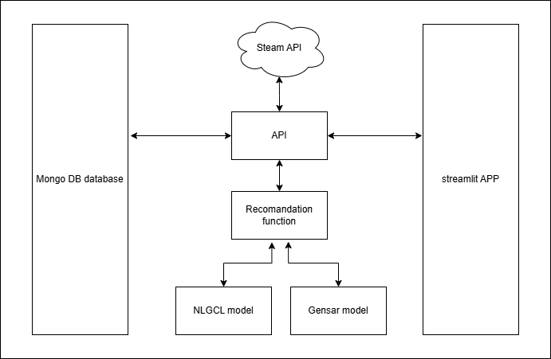
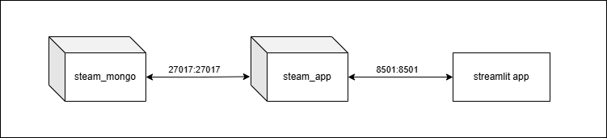
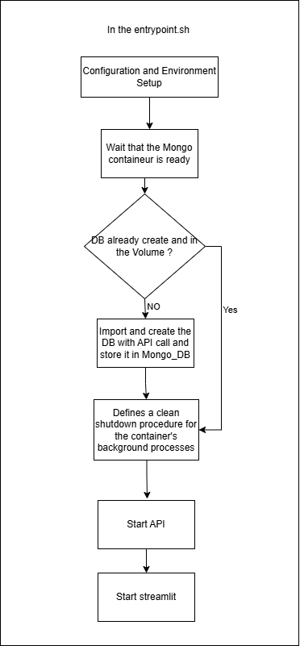
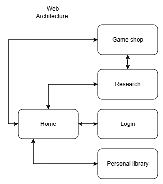

## 📄 Project Architecture Documentation

### 1. Global Architecture Diagram

**Diagram:**

This diagram illustrates the **overall workflow and component interaction** of the project.

The **API (Application Programming Interface)** acts as the central hub, mediating communication between the front-end user interface and the data/model components.

* **Front-End / User Interface:** This component is the **Streamlit Application**, which is accessed by the end-users. It sends requests to the API for data display and processing.
* **The API (Central Component):** This component processes requests from the Streamlit UI. It interacts with both the **MongoDB Database** (for data retrieval and storage) and the **Machine Learning (ML) Models** (for predictions or generation tasks).
* **Data Layer:** The **MongoDB** database stores the project's persistent data (likely Steam games, reviews, and user information).
* **Modeling Layer:** This layer includes the **ML Models** (e.g., NLGCL and GenSar, as suggested by the setup script). The API queries these models to fulfill the Streamlit application's needs (e.g., recommendations, content generation).

### 2. Docker Architecture Diagram

**Diagram:** 

This diagram shows how the entire application is containerized using Docker, focusing on isolation and deployment.

It highlights that each major component runs within its own container, managed by Docker Compose (implied by the multi-container setup):

* **API Container:** Hosts the central application logic (e.g., Uvicorn server) and the user interface.
* **MongoDB Container:** Hosts the database instance.

This containerization approach ensures that the application is **portable**, **scalable**, and that dependencies for each service are kept isolated. Communication between these components happens over the Docker network.

Absolument. Je vais vous fournir la description du contenu de `start.sh` et de `docker-entrypoint.sh` en utilisant le même format et en m'appuyant sur les fichiers et diagrammes que vous avez fournis.

### 3\. The `docker-entrypoint.sh` Script (Docker Initialization)

**Diagram:**

This diagram describes the **initial, mandatory execution flow** when a Docker container is started.

The `docker-entrypoint.sh` script is designed for **automatic, one-time setup and service launch** required by the Docker environment. Its primary role is to ensure dependencies are met before starting the application and to handle clean process shutdown.

  * **Role in Docker (Automatic Launch):** It acts as the container's *initializer*. It performs essential environment preparation that must run **automatically** upon container start.
  * **Key Actions:**
      * **Dependency Readiness:** It **waits for the MongoDB container to be ready** using a network check (`nc -z`).
      * **Conditional DB Import:** It runs `DB_import.py` to populate the database **only once** by checking for the presence of a persistent marker file (`/init-state/db_initialized`) in a shared volume.
      * **Process Management:** It defines a `term_handler` to enable a **clean shutdown** of background processes (API and Streamlit) when the container stops.
      * **Service Launch:** It launches both the **API backend (Uvicorn)** and the **Streamlit application** in the background, ensuring both core services are running.

### 4\. The `start.sh` Script (Local/Manual Bootstrap)

**Diagram:**

This diagram illustrates the **full bootstrap process** designed for a **local development environment** (outside of Docker). This script is highly **interactive** and handles creating the environment, optional setup, and service launch.

  * **Role (Local Bootstrap/Maintenance):** It is an **interactive setup script** designed to be run manually by a developer on the host machine. It handles environment creation and prompts the user for major, time-consuming setup steps like model training.
  * **Key Actions:**
      * **Environment Creation:** It checks for and **creates the Python virtual environment** (`.venv`) and installs dependencies. It also ensures the local configuration file (`src/.env`) exists.
      * **Interactive Setup:** It prompts the user for confirmation (`prompt_yes`) to run the **optional global setup** (Step 3).
      * **Customizable DB Import:** If confirmed, it runs `DB_import.py`, allowing the user to customize parameters like the number of workers, index creation, and log level.
      * **Optional Model Training:** It asks for confirmation to **retrain the NLGCL and GenSar models**, executing the respective training scripts if accepted.
      * **Local Service Launch:** It attempts to **start the local MongoDB service** and then launches the API (`uvicorn`) and Streamlit application in the background.

Je comprends que ces pages font partie de votre application **Streamlit**, qui sert d'interface utilisateur pour votre système de recommandation de jeux Steam.

Ces modules et leur architecture de navigation correspondent directement aux différentes vues (ou pages) que l'utilisateur verra dans l'application.

## 5\. Web Architecture Diagram (Steam Game Recommendation)

**Diagram:**

This diagram illustrates the **navigation flow and core modules** of the user interface (UI), which facilitates Steam game recommendations and interactions. **These modules directly represent the different pages or views within your Streamlit application.**

  * **Home:** This is the **central entry point** and the main landing **page of the Streamlit application**. It likely displays featured games, personalized recommendations, and provides navigation to all other modules.
  * **Login:** The **authentication page** where users log in to access personalized data and recommendations based on their history.
  * **Personal Library:** The **Streamlit page** that displays the **user's collection of owned or previously reviewed Steam games**. This data is crucial for the recommendation models.
  * **Research (Search/Discovery):** The **search page** providing filtering functionality for exploring the Steam game catalogue. This module likely links to the underlying **MongoDB data**.
  * **Game Shop:** Represents the **game detail pages or the catalogue view**. Users navigate here to view information, reviews, and potentially purchase games.

The flows indicate a tightly integrated system where user activity (Login, Library, Research) feeds the central **Home** experience, which in turn drives interactions with the **recommendation-focused ChatBot**.
